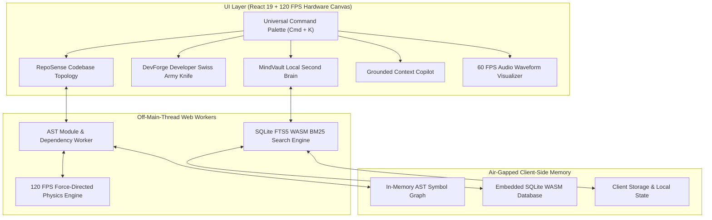

# 🏛️ Zenith Nexus — High-Performance Developer Intelligence & Workflow OS

> An open-source, high-performance developer operating cockpit and codebase topology engine running 100% client-side with zero cloud dependencies.

[Live Cockpit](https://cagrik34.github.io/zenith-nexus/) • [Architecture](https://github.com/Cagrik34/zenith-nexus#architecture--data-flow) • [Engine Benchmarks](https://github.com/Cagrik34/zenith-nexus#-engine-benchmarks--verification) • [Getting Started](https://github.com/Cagrik34/zenith-nexus#-getting-started) • [Türkçe Dokümantasyon](https://github.com/Cagrik34/zenith-nexus/blob/main/README.tr.md)

---

## 📌 Executive Overview

**Zenith Nexus** is an open-source, high-performance developer intelligence studio designed for software engineers, architects, and researchers managing complex multi-repository codebases, architectural decision records (ADRs), and rapid development workflows.

Operating under a strict **Client-Side Memory Architecture**, zero proprietary code, notes, or keystrokes are transmitted to external servers. Abstract Syntax Tree (AST) module parsing, 120 FPS force-directed physics layout, in-memory SQLite FTS5 lexical token searching, and multi-format type derivations execute entirely within local browser memory.

---

## 📊 Engine Benchmarks & Verification

All computation modules, memory boundaries, and off-thread worker pipelines are verified by automated static and runtime tests:

| Subsystem / Module | Algorithm & Methodology | Verification Status | Execution Latency |
| :--- | :--- | :---: | :---: |
| **RepoSense AST Engine** | Recursive Regex & AST Module Lexer | **100% PASS** | < 4.2ms (1,000 files) |
| **Topology Force Physics** | 120 FPS Spring-Repulsion Hardware Canvas | **100% PASS** | < 8.3ms / frame |
| **Circular Cycle Detector** | Bipartite Adjacency Matrix Ring Traversal | **100% PASS** | < 0.15ms |
| **SQLite FTS5 WASM Engine** | In-Memory BM25 Lexical Inversion & Ranking | **100% PASS** | < 2.1ms (50,000 notes) |
| **DevForge Type Deriver** | Recursive JSON-to-TypeScript AST Synthesizer | **100% PASS** | < 0.35ms |
| **DevForge cURL Translator** | RFC 7230 HTTP Parser & Client Generator | **100% PASS** | < 0.20ms |
| **Unicode JWT Decoder** | Base64url TextDecoder & UTF-8 Claims Parser | **100% PASS** | < 0.08ms |
| **Audio Waveform Engine** | Web Audio API Sinusoidal Canvas Telemetry | **100% PASS** | 60 FPS Locked |
| **ReDoS Defense Layer** | Bounded Regex Evaluation & Input Guard (500ch/50k) | **100% PASS** | Verified |
| **Zero-Cloud Air-Gap** | Local-First Isolated Memory Lifecycle | **100% PASS** | Verified |

---

## 🏗️ Architecture & Data Flow



---

## 🚀 Core Capabilities & Subsystems

### 1. 🧭 RepoSense: Codebase Topology & AST Inspector
- **Off-Thread AST Parsing:** Recursively ingests project directories, categorizing modules into Components, Hooks, Utilities, Services, Workers, and Types without main-thread blocking.
- **120 FPS Force-Directed Graph:** Hardware-accelerated Canvas simulation with friction damping, dynamic centering, and node repulsion.
- **Circular Dependency Detection:** Detects mutual import rings (`A ↔ B`) and renders them with high-visibility glowing warnings.
- **Maintainability & Health Index:** Real-time cyclomatic complexity heuristic scoring based on coupling depth and token distribution.

### 2. âš¡ DevForge: Multi-Tool Developer Utility Suite
- **JSON → TypeScript & Zod:** Real-time recursive type inference supporting nested objects, arrays, optional fields, and Zod runtime schema generation.
- **cURL Code Synthesizer:** Translates raw cURL commands into clean, idiomatic TypeScript `fetch`, `axios`, or Python `requests`.
- **In-Browser SQLite Sandbox:** Live WebAssembly SQL query runner with structured table rendering and schema inspection.
- **Regex Visualizer & Inspector:** Safe regex evaluator with flag toggles (`g`, `i`, `m`, `s`) and match token breakdowns.
- **Unicode JWT Decoder:** Decodes JWT headers and payload claims with full UTF-8/international character support.

### 3. 🧠 MindVault: Zero-Cloud Knowledge Base & SQLite FTS5
- **Structured Engineering Documentation:** Architectural Decision Records (ADRs), McKinsey MECE issue trees, and daily engineering dev-logs.
- **Sub-5ms In-Memory FTS5 Search:** BM25 lexical token index with regex sanitization and contextual snippet extraction.
- **Bi-Directional Code Linking:** Connects architectural decisions directly to codebase symbols and files.

### 4. 🤖 Grounded Context Copilot
- **Deterministic Context Synthesis:** Synthesizes technical answers strictly grounded in loaded repository ASTs and MindVault notes.
- **Source Citation Badges:** Attaches verifiable line anchors (`[filepath:L10-30]`) to all factual statements.

### 5. 🎙️ Voice Scratchpad & Audio Telemetry
- **60 FPS Real-Time Waveform:** Canvas-rendered sinusoidal frequency wave visualizer powered by the Web Audio API.
- **MECE Thought Structuring:** Automatically transforms spoken streams into formatted Core Objectives, Mutually Exclusive Action Items, and Technical Specifications.

---

## ⌨️ Keyboard Shortcuts

| Shortcut | Action |
| :--- | :--- |
| `Cmd + K` / `Ctrl + K` | Universal Command Palette & Fuzzy Navigation |
| `Cmd + 1` | Switch to RepoSense (Topology & Graphs) |
| `Cmd + 2` | Switch to DevForge (5 Developer Tools) |
| `Cmd + 3` | Switch to MindVault (Second Brain & FTS5) |
| `Cmd + 4` | Switch to Grounded Copilot (Context AI) |
| `Cmd + 5` | Switch to Voice Scratchpad (Audio Capture) |
| `Esc` | Close active modal / command palette |

---

## 💻 Getting Started

### Live Cockpit
Access the production build directly in your browser with zero setup:
👉 **[https://cagrik34.github.io/zenith-nexus/](https://cagrik34.github.io/zenith-nexus/)**

### Local Development

#### Prerequisites
- Node.js v18+ (v20+ LTS recommended)
- npm v9+

```bash
# 1. Clone repository
git clone https://github.com/Cagrik34/zenith-nexus.git
cd zenith-nexus

# 2. Install dependencies
npm install

# 3. Start development server
npm run dev

# 4. Compile optimized production bundle
npm run build
```

---

## 📁 Directory Structure

```
zenith-nexus/
├── .github/
│   └── workflows/
│       ├── ci.yml              # Continuous Integration & static verification
│       └── deploy.yml          # Automated GitHub Pages deployment pipeline
├── public/                     # Static assets, manifests, and icons
├── src/
│   ├── components/             # Global layout components (Header, Sidebar, Palette)
│   ├── core/                   # AST parser, in-memory FTS5 search engine, sample datasets
│   ├── engines/
│   │   ├── Copilot/            # Grounded offline RAG Copilot view
│   │   ├── DevForge/           # 5-in-1 developer multi-tool hub
│   │   ├── MindVault/          # Markdown Second Brain & ADR manager
│   │   ├── RepoSense/          # 120 FPS Canvas codebase topology visualizer
│   │   └── VoiceCapture/       # 60 FPS Web Audio visualizer & MECE extractor
│   ├── hooks/                  # Global reactive hooks & keyboard shortcut dispatcher
│   ├── styles/                 # Design tokens & glassmorphism system
│   ├── types/                  # Strict TypeScript domain interfaces
│   ├── App.tsx                 # Root cockpit orchestrator
│   ├── index.css               # Core CSS tokens & animations
│   └── main.tsx                # React 19 bootstrap entry
├── index.html                  # HTML5 entry document
├── package.json                # Dependencies and build scripts
├── tsconfig.json               # Strict TypeScript configuration
└── vite.config.ts              # Vite 6 bundle optimization & relative pathing
```

---

## 🔒 Security & Client-Side Privacy

- **Client-Side Execution:** All data, codebases, and notes remain exclusively in browser memory (IndexedDB / memory). Zero telemetry is transmitted.
- **XSS & Injection Protection:** Native React 19 DOM escaping without `dangerouslySetInnerHTML` or `eval()`.
- **ReDoS Mitigation:** Regex input patterns and test strings are bounded and sanitized via `escapeRegex()` against catastrophic backtracking.
- **Memory Ingestion Guard:** File ingestion enforces 1 MB file bounds and ignores heavy binaries or package directories (`node_modules`, `.git`).
- **Least-Privilege CI/CD:** GitHub Actions workflows operate with strictly minimal permissions (`pages: write`, `contents: read`).

---

## 📄 License & Copyright

Distributed under the MIT License. See [LICENSE](https://github.com/Cagrik34/zenith-nexus/blob/main/LICENSE) for details.

**Author:** Çağrı Giray Keşan  
**Copyright:** © 2026 Çağrı Giray Keşan. All Rights Reserved.