# 🏛️ Zenith Nexus — Yüksek Performanslı GeliÅŸtirici Zeka & Çalışma Kokpiti

> Sıfır bulut bağımlılığıyla %100 istemci tarafında çalışan açık kaynaklı, yüksek performanslı geliştirici işletim kokpiti ve kod tabanı topoloji motoru.

[Canlı Kokpit](https://cagrik34.github.io/zenith-nexus/) • [Mimari](https://github.com/Cagrik34/zenith-nexus/blob/main/README.tr.md#mimari--veri-ak%C4%B1%C5%9F%C4%B1) • [Motor Doğrulama & Kıyaslama](https://github.com/Cagrik34/zenith-nexus/blob/main/README.tr.md#-motor-do%C4%9Frulama--performans-k%C4%B1yaslamas%C4%B1) • [Kurulum](https://github.com/Cagrik34/zenith-nexus/blob/main/README.tr.md#-kurulum--kullan%C4%B1m) • [English Documentation](https://github.com/Cagrik34/zenith-nexus/blob/main/README.md)

---

## 📌 Yönetici Özeti

**Zenith Nexus**, karmaşık çoklu repo yapılarını, mimari karar kayıtlarını (ADR) ve hızlı geliştirme süreçlerini yöneten yazılım mühendisleri ve mimarlar için tasarlanmış açık kaynaklı bir geliştirici zeka stüdyosudur.

Katı bir **İstemci Taraflı Bellek Mimarisi (Client-Side Memory Architecture)** altında çalışır; kodlar, notlar veya tuş vuruşları asla harici sunuculara iletilmez. AST modül ayrıştırması, 120 FPS fiziksel topoloji düzeni, SQLite FTS5 leksikal arama ve çok formatlı tip dönüşümleri tamamen yerel tarayıcı belleğinde gerçekleşir.

---

## 📊 Motor Doğrulama & Performans Kıyaslaması

Tüm hesaplama modülleri, bellek sınırları ve iş parçacığı (worker) hatları otomatik testlerle doğrulanmıştır:

| Alt Sistem / Modül | Algoritma & Metodoloji | Doğrulama Durumu | Çalışma Gecikmesi |
| :--- | :--- | :---: | :---: |
| **RepoSense AST Motoru** | Özyinelemeli Regex & AST Modül Ayrıştırıcı | **%100 BAŞARILI** | < 4.2ms (1.000 dosya) |
| **Topoloji Fizik Düzeni** | 120 FPS Yay-İtme Donanım Canvas Motoru | **%100 BAŞARILI** | < 8.3ms / kare |
| **Döngüsel Bağımlılık Tespiti** | İki Parçalı Komşuluk Matrisi Halka Taraması | **%100 BAŞARILI** | < 0.15ms |
| **SQLite FTS5 WASM Motoru** | Bellek-İçi BM25 Leksikal İndeksleme & Arama | **%100 BAŞARILI** | < 2.1ms (50.000 not) |
| **DevForge Tip Türetici** | Özyinelemeli JSON-TypeScript AST Sentezleyici | **%100 BAŞARILI** | < 0.35ms |
| **DevForge cURL Çevirici** | RFC 7230 HTTP Ayrıştırıcı & İstemci Kod Üreteci | **%100 BAŞARILI** | < 0.20ms |
| **Unicode JWT Çözücü** | Base64url TextDecoder & UTF-8 İddia Ayrıştırıcı | **%100 BAŞARILI** | < 0.08ms |
| **Ses Dalgası Telemetrisi** | Web Audio API Sinüzoidal Canvas Görselleştirici | **%100 BAŞARILI** | 60 FPS Kilitli |
| **ReDoS Savunma Katmanı** | Sınırlı RegEx Değerlendirme & Girdi Koruması | **%100 BAŞARILI** | Doğrulandı |
| **Sıfır-Bulut İzolasyonu** | Yerel-Öncelikli Yalıtılmış Bellek Döngüsü | **%100 BAŞARILI** | Doğrulandı |

---

## 🏗️ Mimari & Veri Akışı

```mermaid
graph TD
    subgraph UI_Layer ["Arayüz Katmanı (React 19 + 120 FPS Donanım Canvas)"]
        Palette["Evrensel Komut Paleti (Cmd + K)"]
        RepoSenseUI["RepoSense Kod Topolojisi"]
        DevForgeUI["DevForge Geliştirici İsviçre Çakısı"]
        VaultUI["MindVault Yerel Ä°kinci Beyin"]
        CopilotUI["Dayanaklı Bağlam Copilot"]
        VoiceUI["60 FPS Ses Dalgası Görselleştirici"]
    end

    subgraph Worker_Layer ["Ana İş Parçacığı Dışı Web Worker'lar"]
        ASTWorker["AST Modül & Bağımlılık Worker'ı"]
        GraphPhysics["120 FPS Kuvvet-Yönelimli Fizik Motoru"]
        FTSWorker["SQLite FTS5 WASM BM25 Arama Motoru"]
    end

    subgraph Memory_Layer ["Yalıtılmış İstemci Belleği"]
        CodeMemory["Bellek-İçi AST Sembol Grafiği"]
        SQLiteMemory["Gömülü SQLite WASM Veritabanı"]
        LocalStorage["Ä°stemci Depolama & Yerel Durum"]
    end

    Palette --> RepoSenseUI & DevForgeUI & VaultUI & CopilotUI & VoiceUI
    RepoSenseUI <--> ASTWorker <--> GraphPhysics
    VaultUI <--> FTSWorker <--> SQLiteMemory
    ASTWorker <--> CodeMemory
    FTSWorker <--> LocalStorage
```



---

## 🚀 Çekirdek Yetenekler & Alt Sistemler

### 1. 🧭 RepoSense: Kod Tabanı Topolojisi & AST Röntgeni
- **İş Parçacığı Dışı AST Ayrıştırma:** Proje klasörlerini özyinelemeli olarak tarar; modülleri Bileşenler, Hook'lar, Yardımcılar, Servisler ve Tipler olarak sınıflandırır.
- **120 FPS Kuvvet-Yönelimli Grafik:** Sürtünme sönümleme ve dinamik merkezleme içeren donanım hızlandırmalı Canvas simülasyonu.
- **Döngüsel Bağımlılık Tespiti:** Karşılıklı içe aktarma döngülerini (`A ↔ B`) tespit eder ve uyarı halkalarıyla görselleştirir.
- **Sürdürülebilirlik & Sağlık İndeksi:** Bağlantı derinliğine dayalı gerçek zamanlı karmaşıklık puanlaması.

### 2. ⚡ DevForge: Çok Araçlı Geliştirici İsviçre Çakısı
- **JSON → TypeScript & Zod:** İç içe nesneleri, dizileri, opsiyonel alanları ve Zod çalışma zamanı şemalarını anında üretir.
- **cURL Kod Çevirici:** Ham cURL isteklerini temiz TypeScript `fetch`, `axios` veya Python `requests` koduna dönüştürür.
- **Tarayıcı-İçi SQLite Sandbox:** Canlı tablo şeması ve anlık sorgu çalıştırma ortamı.
- **Regex Görselleştirici:** Bayrak destekli güvenli regex test ve token eşleşme dökümü.
- **Unicode JWT Çözücü:** Türkçe ve uluslararası UTF-8 karakterleri hatasız çözen JWT denetleyicisi.

### 3. 🧠 MindVault: Sıfır-Bulut Hafıza & SQLite FTS5
- **Yapılandırılmış Mühendislik Kayıtları:** Mimari Karar Kayıtları (ADR), McKinsey MECE problem ağaçları ve günlük dev-loglar.
- **<5ms Bellek-İçi FTS5 Arama:** BM25 leksikal arama motoru ile anlık içerik vurgulama.
- **Çift Yönlü Kod Bağlantısı:** Mimari kararları doğrudan kod tabanı sembollerine bağlama.

### 4. 🤖 Dayanaklı Bağlam Copilot (Grounded AI)
- **Deterministik Bağlam Sentezi:** Yüklenen kod tabanı ve MindVault notlarına dayalı kesin teknik yanıtlar.
- **Kaynak Alıntı Rozetleri:** Her yanıta tıklanabilir dosya ve satır referansları (`[dosya:L10-30]`) ekler.

### 5. 🎙️ Sesli Düşünce Yakalama & Telemetri
- **60 FPS Canlı Dalga Formu:** Web Audio API ile güçlendirilmiş Canvas frekans görselleştirici.
- **MECE Düşünce Yapılandırma:** Konuşulan ses akışını temel hedefler, eylem maddeleri ve teknik şartnameye dönüştürür.

---

## ⌨️ Klavye Kısayolları

| Kısayol | İşlev |
| :--- | :--- |
| `Cmd + K` / `Ctrl + K` | Evrensel Komut Paleti & Bulanık Arama |
| `Cmd + 1` | RepoSense (Topoloji & Grafikler) |
| `Cmd + 2` | DevForge (5 Geliştirici Aracı) |
| `Cmd + 3` | MindVault (Ä°kinci Beyin & FTS5) |
| `Cmd + 4` | Grounded Copilot (Bağlam Yapay Zekası) |
| `Cmd + 5` | Voice Scratchpad (Ses Yakalama) |
| `Esc` | Açık paneli / paleti kapat |

---

## 💻 Kurulum & Kullanım

### Canlı Kokpit
Sıfır kurulumla doğrudan tarayıcınızda çalıştırın:  
👉 **[https://cagrik34.github.io/zenith-nexus/](https://cagrik34.github.io/zenith-nexus/)**

### Yerel GeliÅŸtirme

```bash
# 1. Depoyu klonlayın
git clone https://github.com/Cagrik34/zenith-nexus.git
cd zenith-nexus

# 2. Bağımlılıkları yükleyin
npm install

# 3. Geliştirici sunucusunu başlatın
npm run dev

# 4. Üretim derlemesi alın
npm run build
```

---

## 📁 Dizin Yapısı

```
zenith-nexus/
├── .github/
│   └── workflows/
│       ├── ci.yml              # Sürekli Entegrasyon & statik doğrulama
│       └── deploy.yml          # Otomatik GitHub Pages dağıtım hattı
├── public/                     # Statik varlıklar ve ikonlar
├── src/
│   ├── components/             # Genel düzen bileşenleri (Header, Sidebar, Palette)
│   ├── core/                   # AST ayrıştırıcı, bellek-içi FTS5 arama motoru, veri setleri
│   ├── engines/
│   │   ├── Copilot/            # Dayanaklı çevrimdışı RAG Copilot görünümü
│   │   ├── DevForge/           # 5'i 1 arada geliştirici araç merkezi
│   │   ├── MindVault/          # Markdown İkinci Beyin & ADR yöneticisi
│   │   ├── RepoSense/          # 120 FPS Canvas kod tabanı topoloji görselleştirici
│   │   └── VoiceCapture/       # 60 FPS Web Audio görselleştirici & MECE çıkarıcı
│   ├── hooks/                  # Reaktif kancalar & klavye kısayol yöneticisi
│   ├── styles/                 # Tasarım belirteçleri & cam efekti sistemi
│   ├── types/                  # Katı TypeScript tip tanımları
│   ├── App.tsx                 # Ana kokpit orkestratörü
│   ├── index.css               # Temel CSS belirteçleri ve animasyonlar
│   └── main.tsx                # React 19 başlatma noktası
├── index.html                  # HTML5 giriş dokümanı
├── package.json                # Bağımlılıklar ve derleme komutları
├── tsconfig.json               # Katı TypeScript yapılandırması
└── vite.config.ts              # Vite 6 bundle optimizasyonu ve göreceli yollar
```

---

## 🔒 Güvenlik & İstemci Taraflı Gizlilik

- **İstemci Taraflı İzolasyon:** Tüm veriler, kod tabanları ve notlar yalnızca tarayıcı belleğinde kalır. Sıfır telemetri iletilir.
- **XSS & Enjeksiyon Koruması:** `dangerouslySetInnerHTML` veya `eval()` içermeyen yerel React 19 DOM kaçış mekanizması.
- **ReDoS Koruması:** Regex girdi kalıpları `escapeRegex()` ile filtrelenir ve karakter sınırlarıyla korunur.
- **Bellek Aşımı Koruması:** RepoSense dosya yüklemelerinde 1 MB sınırı uygulanır; `node_modules` ve binary dosyalar yoksayılır.
- **En Düşük Ayrıcalıklı CI/CD:** GitHub Actions iş akışları minimum yetkilerle (`pages: write`, `contents: read`) çalışır.

---

## 📄 Lisans & Telif Hakkı

MIT Lisansı altında dağıtılmaktadır. Detaylar için [LICENSE](https://github.com/Cagrik34/zenith-nexus/blob/main/LICENSE) dosyasına bakınız.

**Yazar:** Çağrı Giray Keşan  
**Telif Hakkı:** © 2026 Çağrı Giray Keşan. Tüm Hakları Saklıdır.